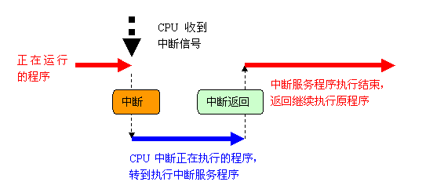

#  1.中断是什么 
中断的汉语解释是半中间发生阻隔、停顿或故障而断开。那么，在计算机系统中，我们为什么需要“阻隔、停顿和断开”呢？

举个日常生活中的例子，比如说我正在厨房用煤气烧一壶水，这样就只能守在厨房里，苦苦等着水开——如果水溢出来浇灭了煤气，有可能就要发生一场灾难了。等啊等啊，外边突然传来了惊奇的叫声“怎么不关水龙头？”于是我惭愧的发现，刚才接水之后只顾着抱怨这份无聊的差事，居然忘了这事，于是慌慌张张的冲向水管，三下两下关了龙头，声音又传到耳边，“怎么干什么都是这么马虎？”。伸伸舌头，这件小事就这么过去了，我落寞的眼神又落在了水壶上。

门外忽然又传来了铿锵有力的歌声，我最喜欢的古装剧要开演了，真想夺门而出，然而，听着水壶发出“咕嘟咕嘟”的声音，我清楚：除非等到水开，否则没有我享受人生的时候。

这个场景跟中断有什么关系呢？

如果说我专心致志等待水开是一个过程的话，那么叫声、电视里传出的音乐不都让这个过程“半中间发生阻隔、停顿或故障而断开”了吗？这不就是活生生的“中断”吗？

在这个场景中，我是唯一具有处理能力的主体，不管是烧水、关水龙头还是看电视，同一个时间点上我只能干一件事情。但是，在我专心致志干一件事情时，总有许多或紧迫或不紧迫的事情突然出现在面前，都需要去关注，有些还需要我停下手头的工作马上去处理。只有在处理完之后，方能回头完成先前的任务，“把一壶水彻底烧开！”

中断机制不仅赋予了我处理意外情况的能力，如果我能充分发挥这个机制的妙用，就可以“同时”完成多个任务了。回到烧水的例子，实际上，无论我在不在厨房，煤气灶总是会把水烧开的，我要做的，只不过是及时关掉煤气灶而已，为了这么一个一秒钟就能完成的动作，却让我死死地守候在厨房里，在10分钟的时间里不停地看壶嘴是不是冒蒸气，怎么说都不划算。我决定安下心来看电视。当然，在有生之年，我都不希望让厨房成为火海，于是我上了闹钟，10分钟以后它会发出“尖叫”，提醒我炉子上的水烧开了，那时我再去关煤气也完全来得及。我用一个中断信号——闹铃——换来了10分钟的欢乐时光，心里不禁由衷地感叹：中断机制真是个好东西。

正是由于中断机制，我才能有条不紊地“同时”完成多个任务，中断机制实质上帮助我提高了并发“处理”能力。它也能给计算机系统带来同样的好处：如果在键盘按下的时候会得到一个中断信号，CPU就不必死守着等待键盘输入了；如果硬盘读写完成后发送一个中断信号，CPU就可以腾出手来集中精力“服务大众”了——无论是人类敲打键盘的指尖还是来回读写介质的磁头，跟CPU的处理速度相比，都太慢了。没有中断机制，就像我们苦守厨房一样，计算机谈不上有什么并行处理能力。

跟人相似，CPU也一样要面对纷繁芜杂的局面——现实中的意外是无处不在的——有可能是用户等得不耐烦，猛敲键盘；有可能是运算中碰到了0除数；还有可能网卡突然接收到了一个新的数据包。这些都需要CPU具体情况具体分析，要么马上处理，要么暂缓响应，要么置之不理。无论如何应对，都需要CPU暂停“手头”的工作，拿出一种对策，只有在响应之后，方能回头完成先前的使命，“把一壶水彻底烧开！”

先让我们感受一下中断机制对并发处理带来的帮助。

让我们用程序来探讨一下烧水问题，如果没有“中断”（注意，我们这里只是模仿中断的场景，实际上是用异步事件——消息——处理机制来展示中断产生的效果。毕竟，在用户空间没有办法与实际中断产生直接联系，不过操作系统为用户空间提供的异步事件机制，可以看作是模仿中断的产物），设计如下：

```c
void StayInKitchen()
{
bool WaterIsBoiled = false;
while ( WaterIsBoiled != true )
{
       bool VaporGavenOff  = false;
              if  (VaporGavenOff )
                     WaterIsBoiled  = true;
else

              WaterIsBoiled  = false;
}
// 关煤气炉
printf(“Close gas oven.\n”);
// 一切安定下来，终于可以看电视了，10分钟的宝贵时间啊，逝者如斯夫…
watching_tv();
return;
}
```
可以看出，整个流程如同我们前面描述的一样，所有工作要顺序执行，没有办法完成并发任务。

如果用“中断”，在开始烧水的时候设定一个10分钟的“闹铃”，然后让CPU去看电视（有点难度，具体实现不在我们关心的范围之内，留给读者自行解决吧：>）。等闹钟响的时候再去厨房关炉子。

```c
#include <sys/types.h>
#include <unistd.h>
#include <sys/stat.h>
#include <signal.h>
#include <stdio.h>

// 闹钟到时会执行此程序
void sig_alarm(int signo)
{
       //关煤气炉
       printf(“Close gas oven.\n”);
}
 
void watching_tv()
{
       while(1)
       {
              // 呵呵，悠哉悠哉
       }
}

int main()
{
// 点火后设置定时中断
	printf(“Start to boil water, set Alarm”);
	if (signal( SIGALRM, sig_alrm ) == SIG_ERR)
	{
    	perror("signal(SIGALRM) error");
   		return -1;
  	}
// 然后就可以欣赏电视节目了
  	printf(“Watching TV!\n”);
	watching_tv();
	return 0;
}
```

这两段程序都在用户空间执行。第二段程序跟中断也没有太大的关系，实际上它只用了信号机制而已。但是，通过这两个程序的对比，我们可以清楚地看到异步事件的处理机制是如何提升并发处理能力的。

**Alarm定时器**：alarm相当于系统中的一个定时器，如果我们调用alarm(5)，那么5秒钟后就会“响起一个闹铃”（实际上靠信号机制实现的，我们这里不想深入细节，如果你对此很感兴趣，请参考Richard Stevens不朽著作《Unix环境高级编程》）。在闹铃响起的时候会发生什么呢?系统会执行一个函数，至于到底是什么函数，系统允许程序自行决定。程序员编写一个函数，并调用signal对该函数进行注册，这样一旦定时到来，系统就会调用程序员提供的函数（CallBack函数？没错，不过在这里如何实现并不关键，我们就不引入新的概念和细节了）。上面的例子里我们提供的函数是sig_alarm，所做的工作很简单，打印“关闭煤气灶”消息。

上面的两个例子很简单，但很能说明问题，首先，它证明采用异步的消息处理机制可以提高系统的并发处理能力。更重要的是，它揭示了这种处理机制的模式。用户根据需要设计处理程序，并可以将该程序和特定的外部事件绑定起来，在外部事件发生时系统自动调用处理程序，完成相关工作。这种模式给系统带来了统一的管理方法，也带来无尽的功能扩展空间。

计算机系统实现中断机制是非常复杂的一件工作，再怎么说人都是高度智能化的生物，而计算机作为一个铁疙瘩，没有程序的教导就一事无成。而处理一个中断过程，它受到的限制和需要学习的东西太多了。

首先，计算机能够接收的外部信号形式非常有限。中断是由外部的输入引起的，可以说是一种刺激。在烧水的场景中，这些输入是叫声和电视的音乐，我们这里只以声音为例。其实现实世界中能输入人类CPU——大脑的信号很多，图像、气味一样能被我们接受，人的信息接口很完善。而计算机则不然，接受外部信号的途径越多，设计实现就越复杂，代价就越高。因此个人计算机（PC）给所有的外部刺激只留了一种输入方式——特定格式的电信号，并对这种信号的格式、接入方法、响应方法、处理步骤都做了规约（具体内容本文后面部分会继续详解），这种信号就是中断或中断信号，而这一整套机制就是中断机制。

其次，计算机不懂得如何应对信号。人类的大脑可以自行处理外部输入，我从来不用去担心闹钟响时会手足无措——走进厨房关煤气，这简直是天经地义的事情，还用大脑想啊，小腿肚子都知道——可惜计算机不行，没有程序，它就纹丝不动。因此，必须有机制保证外部中断信号到来后，有正确的程序在正确的时候被执行。

还有，计算机不懂得如何保持工作的持续性。我在看电视的时候如果去厨房关了煤气，回来以后能继续将电视进行到底，不受太大的影响。而计算机则不然，如果放下手头的工作直接去处理“意外”的中断，那么它就再也没有办法想起来曾经作过什么，做到什么程度了。自然也就没有什么“重操旧业”的机会了。这样的处理方式就不是并发执行，而是东一榔头，西一棒槌了。

那么，通用的计算机系统是如何解决这些问题的呢？它是靠硬件和软件配合来协同实现中断处理的全过程的。我们将通过Intel X86架构的实现来介绍这一过程。

CPU执行完一条指令后，下一条指令的逻辑地址存放在cs和eip这对寄存器中。在执行新指令前，控制单元会检查在执行前一条指令的过程中是否有中断或异常发生。如果有，控制单元就会抛下指令，进入下面的流程：

1. 确定与中断或异常关联的向量i (0£i£255)
2. 寻找向量对应的处理程序
3. 保存当前的“工作现场”，执行中断或异常的处理程序
4. 处理程序执行完毕后，把控制权交还给控制单元
5. 控制单元恢复现场，返回继续执行原程序
整个流程如下图所示

图一：中断处理过程

让我们深入这个流程，看看都有什么问题需要面对。

1、异常是什么概念？
在处理器执行到由于编程失误而导致的错误指令（例如除数是0）的时候，或者在执行期间出现特殊情况（例如缺页），需要靠操作系统来处理的时候，处理器就会产生一个异常。对大部分处理器体系结构来说，处理异常和处理中断的方式基本是相同的，x86架构的CPU也是如此。异常与中断还是有些区别，异常的产生必须考虑与处理器时钟的同步。实际上，异常往往被称为同步中断。

2、中断向量是什么？
中断向量代表的是中断源——从某种程度上讲，可以看作是中断或异常的类型。中断和异常的种类很多，比如说被0除是一种异常，缺页又是一种异常，网卡会产生中断，声卡也会产生中断，CPU如何区分它们呢？中断向量的概念就是由此引出的，其实它就是一个被送通往CPU数据线的一个整数。CPU给每个IRQ分配了一个类型号，通过这个整数CPU来识别不同类型的中断。这里可能很多朋友会寻问为什么还要弄个中断向量这么麻烦的东东？为什么不直接用IRQ0~IRQ15就完了？比如就让IRQ0为0，IRQ1为1……，这不是要简单得多么？其实这里体现了模块化设计规则，及节约规则。

首先我们先谈谈节约规则，所谓节约规则就是所使用的信号线数越少越好，这样如果每个IRQ都独立使用一根数据线，如IRQ0用0号线，IRQ1用1号线……这样，16个IRQ就会用16根线，这显然是一种浪费。那么也许马上就有朋友会说：那么只用4根线不就行了吗？（2^4=16）。

这个问题，体现了模块设计规则。我们在前面就说过中断有很多类，可能是外部硬件触发，也可能是由软件触发，然而对于CPU来说中断就是中断，只有一种，CPU不用管它到底是由外部硬件触发的还是由运行的软件本身触发的，因为对于CPU来说，中断处理的过程都是一样的：中断现行程序，转到中断服务程序处执行，回到被中断的程序继续执行。CPU总共可以处理256种中断，而并不知道，也不应当让CPU知道这是硬件来的中断还是软件来的中断，这样，就可以使CPU的设计独立于中断控制器的设计，这样CPU所需完成的工作就很单纯了。CPU对于其它的模块只提供了一种接口，这就是256个中断处理向量，也称为中断号。由这些中断控制器自行去使用这256个中断号中的一个与CPU进行交互，比如，硬件中断可以使用前128个号，软件中断使用后128个号，也可以软件中断使用前128个号，硬件中断使用后128个号，这与CPU完全无关了，当你需要处理的时候，只需告诉CPU你用的是哪个中断号就行，而不需告诉CPU你是来自哪儿的中断。这样也方便了以后的扩充，比如现在机器里又加了一片8259芯片，那么这个芯片就可以使用空闲的中断号，看哪一个空闲就使用哪一个，而不是必须要使用第0号，或第1号中断号了。其实这相当于一种映射机制，把IRQ信号映射到不同的中断号上，IRQ的排列或说编号是固定的，但通过改变映射机制，就可以让IRQ映射到不同的中断号，也可以说调用不同的中断服务程序。

3、什么是中断服务程序？
在响应一个特定中断的时候，内核会执行一个函数，该函数叫做中断处理程序（interrupt handler）或中断服务程序（interrupt service routine(ISR)）。产生中断的每个设备都有相应的中断处理程序。例如，由一个函数专门处理来自系统时钟的中断，而另外一个函数专门处理由键盘产生的中断。

一般来说，中断服务程序要负责与硬件进行交互，告诉该设备中断已被接收。此外，还需要完成其他相关工作。比如说网络设备的中断服务程序除了要对硬件应答，还要把来自硬件的网络数据包拷贝到内存，对其进行处理后再交给合适的协议栈或应用程序。每个中断服务程序根据其要完成的任务，复杂程度各不相同。

一般来说，一个设备的中断服务程序是它的设备驱动程序（device driver）的一部分——设备驱动程序是用于对设备进行管理的内核代码。

4、隔离变化
不知道您有没有意识到，中断处理前面这部分的设计是何等的简单优美。人是高度智能化的，能够对遇到的各种意外情况做有针对性的处理，计算机相比就差距甚远了，它只能根据预定的程序进行操作。对于计算机来说，硬件支持的，只能是中断这种电信号传播的方式和CPU对这种信号的接收方法，而具体如何处理这个中断，必须得靠操作系统实现。操作系统支持所有事先能够预料到的中断信号，理论上都不存在太大的挑战，但在操作系统安装到计算机设备上以后，肯定会时常有新的外围设备被加入系统，这可能会带来安装系统时根本无法预料的“意外”中断。如何支持这种扩展，是整个系统必须面对的。

而硬件和软件在这里的协作，给我们带来了完美的答案。当新的设备引入新类型的中断时，CPU和操作系统不用关注如何处理它。CPU只负责接收中断信号，并引用中断服务程序；而操作系统提供默认的中断服务——一般来说就是不理会这个信号，返回就可以了——并负责提供接口，让用户通过该接口注册根据设备具体功能而编制的中断服务程序。如果用户注册了对应于一个中断的服务程序，那么CPU就会在该中断到来时调用用户注册的服务程序。这样，在中断来临时系统需要如何操作硬件、如何实现硬件功能这部分工作就完全独立于CPU架构和操作系统的设计了。

而当你需要加入新设备的时候，只需要告诉操作系统该设备占用的中断号、按照操作系统要求的接口格式撰写中断服务程序，用操作系统提供的函数注册该服务程序，设备的中断就被系统支持了。

中断和对中断的处理被解除了耦合。这样，无论是你在需要加入新的中断时，还是在你需要改变现有中断的服务程序时、又或是取消对某个中断支持的时候，CPU架构和操作系统都无需作改变。

5、保存当前工作“现场”
在中断处理完毕后，计算机一般来说还要回头处理原先手头正做的工作。这给中断的概念带来些额外的“内涵”。注一“回头”不是指从头再来重新做，而是要接着刚才的进度继续做。这就需要在处理中断信号之前保留工作“现场”。“现场”这个词比较晦涩，其实就是指一个信息集，它能反映某个时间点上任务的状态，并能保证按照这些信息就能恢复任务到该状态，继续执行下去。再直白一点，现场不过就是一组寄存器值。而如何保护现场和恢复场景是中断机制需要考虑的重点之一。

每个中断处理都要经历这个保存和恢复过程，我们可以抽象出其中的步骤：
1.         保存现场
2.         执行具体的中断服务程序
3.         从中断服务返回
4.         恢复现场

上面说过了，“现场”看似在不断变化，没有哪个瞬间相同。但实际上组成现场的要素却不会有任何改变。也就是说，只要我们保存了相关的寄存器状态，现场就能保存下来。而恢复“现场”就是重新载入这些寄存器。换句话说，对于任何一个中断，保护现场和恢复现场所做的都是完全相同的操作。

既然操作相同，实现操作的过程和代码就相同。减少代码的冗余是模块化设计的基本准则，实在没有道理让所有的中断服务程序都重复实现这样的功能，应该将它作为一种基本的结构由底层的操作系统或硬件完成。而对中断的处理过程需要迅速完成，因此，Intel CPU的控制器就承担了这个任务，非但如此，上面的所有步骤次序都被固化下来，由控制器驱动完成。保存现场和恢复现场都由硬件自动完成，大大减轻了操作系统和设备驱动程序的负担。

6、硬件对中断支持的细节
下面的部分，本来应该介绍8259、中断控制器编程、中断描述符表等内容，可是我看到了潇寒写的“保护模式下的8259A芯片编程及中断处理探究”（见参考资料1），前人之述备矣，读者直接读它好了。 

# 从外而内，Linux对中断的支持

在Linux中，中断处理程序看起来就是普普通通的C函数。只不过这些函数必须按照特定的类型声明，以便内核能够以标准的方式传递处理程序的信息，在其他方面，它们与一般的函数看起来别无二致。中断处理程序与其它内核函数的真正区别在于，中断处理程序是被内核调用来响应中断的，而它们运行于我们称之为中断上下文的特殊上下文中。关于中断上下文，我们将在后面讨论。

中断可能随时发生，因此中断处理程序也就随时可能执行。所以必须保证中断处理程序能够快速执行，这样才能保证尽可能快地恢复被中断代码的执行。因此，尽管对硬件而言，迅速对其中断进行服务非常重要。但对系统的其它部分而言，让中断处理程序在尽可能短的时间内完成执行也同样重要。

即使最精简版的中断服务程序，它也要与硬件进行交互，告诉该设备中断已被接收。但通常我们不能像这样给中断服务程序随意减负，相反，我们要靠它完成大量的其它工作。作为一个例子，我们可以考虑一下网络设备的中断处理程序面临的挑战。该处理程序除了要对硬件应答，还要把来自硬件的网络数据包拷贝到内存，对其进行处理后再交给合适的协议栈或应用程序。显而易见，这种运动量不会太小。  

现在我们来分析一下Linux操作系统为了支持中断机制，具体都需要做些什么工作。

首先，操作系统必须保证新的中断能够被支持。计算机系统硬件留给外设的是一个统一的中断信号接口。它固化了中断信号的接入和传递方法，拿PC机来说，中断机制是靠两块8259和CPU协作实现的。外设要做的只是把中断信号发送到8259的某个特定引脚上，这样8259就会为此中断分配一个标识——也就是通常所说的中断向量，通过中断向量，CPU就能够在以中断向量为索引的表——中断向量表——里找到中断服务程序，由它决定具体如何处理中断。（具体细节还请查阅参考资料1，对于为何采用这种机制，该资料有精彩描述）这是硬件规定的机制，软件只能无条件服从。

因此，操作系统对新中断的支持，说简单点，就是维护中断向量表。新的外围设备加入系统，首先得明确自己的中断向量号是多少，还得提供自身中断的服务程序，然后利用Linux的内核调用界面，把〈中断向量号、中断服务程序〉这对信息填写到中断向量表中去。这样CPU在接收到中断信号时就会自动调用中断服务程序了。这种注册操作一般是由设备驱动程序完成的。

其次，操作系统必须提供给程序员简单可靠的编程界面来支持中断。中断的基本流程前面已经讲了，它会打断当前正在进行的工作去执行中断服务程序，然后再回到先前的任务继续执行。这中间有大量需要解决问题：如何保护现场、嵌套中断如何处理等等，操作系统要一一化解。程序员，即使是驱动程序的开发人员，在写中断服务程序的时候也很少需要对被打断的进程心存怜悯。（当然，出于提高系统效率的考虑，编写驱动程序要比编写用户级程序多一些条条框框，谁让我们顶着系统程序员的光环呢？）

操作系统为我们屏蔽了这些与中断相关硬件机制打交道的细节，提供了一套精简的接口，让我们用极为简单的方式实现对实际中断的支持，Linux是怎么完美的做到这一点的呢？

CPU对中断处理的流程：

我们首先必须了解CPU在接收到中断信号时会做什么。没办法，操作系统必须了解硬件的机制，不配合硬件就寸步难行。现在我们假定内核已被初始化，CPU在保护模式下运行。

CPU执行完一条指令后，下一条指令的逻辑地址存放在cs和eip这对寄存器中。在执行新指令前，控制单元会检查在执行前一条指令的过程中是否有中断或异常发生。如果有，控制单元就会抛下指令，进入下面的流程：
1. 确定与中断或异常关联的向量i (0£i£255)。
2. 籍由idtr寄存器从IDT表中读取第i项（在下面的描述中，我们假定该IDT表项中包含的是一个中断门或一个陷阱门）。
3. 从gdtr寄存器获得GDT的基地址，并在GDT表中查找，以读取IDT表项中的选择符所标识的段描述符。这个描述符指定中断或异常处理程序所在段的基地址。
4. 确信中断是由授权的（中断）发生源发出的。首先将当前特权级CPL（存放在cs寄存器的低两位）与段描述符（即DPL，存放在GDT中）的描述符特权级比较，如果CPL小于DPL，就产生一个“通用保护”异常，因为中断处理程序的特权不能低于引起中断的程序的特权。对于编程异常，则做进一步的安全检查：比较CPL与处于IDT中的门描述符的DPL，如果DPL小于CPL，就产生一个“通用保护”异常。这最后一个检查可以避免用户应用程序访问特殊的陷阱门或中断门。
5. 检查是否发生了特权级的变化，也就是说， CPL是否不同于所选择的段描述符的DPL。如果是，控制单元必须开始使用与新的特权级相关的栈。通过执行以下步骤来做到这点：
- a.读tr寄存器，以访问运行进程的TSS段。
- b.用与新特权级相关的栈段和栈指针的正确值装载ss和esp寄存器。这些值可以在TSS中找到（参见第三章的“任务状态段”一节）。
- c.在新的栈中保存ss和esp以前的值，这些值定义了与旧特权级相关的栈的逻辑地址。
6. 如果故障已发生，用引起异常的指令地址装载cs和eip寄存器，从而使得这条指令能再次被执行。
7. 在栈中保存eflag、cs及eip的内容。
8. 如果异常产生了一个硬错误码，则将它保存在栈中。
9. 装载cs和eip寄存器，其值分别是IDT表中第i项门描述符的段选择符和偏移量域。这些值给出了中断或者异常处理程序的第一条指令的逻辑地址。 

控制单元所执行的最后一步就是跳转到中断或者异常处理程序。换句话说，处理完中断信号后，控制单元所执行的指令就是被选中的处理程序的第一条指令。

中断或异常被处理完后，相应的处理程序必须产生一条iret指令，把控制权转交给被中断的进程，这将迫使控制单元：
1. 用保存在栈中的值装载cs、eip、或eflag寄存器。如果一个硬错误码曾被压入栈中，并且在eip内容的上面，那么，执行iret指令前必须先弹出这个硬错误码。
2. 检查处理程序的CPL是否等于cs中最低两位的值（这意味着被中断的进程与处理程序运行在同一特权级）。如果是，iret终止执行；否则，转入下一步。
3. 从栈中装载ss和esp寄存器，因此，返回到与旧特权级相关的栈。

4. 检查ds、es、fs及gs段寄存器的内容，如果其中一个寄存器包含的选择符是一个段描述符，并且其DPL值小于CPL，那么，清相应的段寄存器。控制单元这么做是为了禁止用户态的程序（CPL=3）利用内核以前所用的段寄存器（DPL=0）。如果不清这些寄存器，怀有恶意的用户程序就可能利用它们来访问内核地址空间。

再次，操作系统必须保证中断信息能够高效可靠的传递

注一：那么PowerOff（关机）算不算中断呢？如果从字面上讲，肯定符合汉语对中断的定义，但是从信号格式、处理方法等方面来看，就很难符合我们的理解了。Intel怎么说的呢？该中断没有采用通用的中断处理机制。那么到底是不是中断呢？我也说不上来：（

注二：更详细的内容和其它一些注意事项请参考内核源代码包中Documentations/rtc.txt

注三：之所以这里使用汇编而不是C来实现这些函数，是因为C编译器会在函数的实现中推入额外的栈信息。而CPU在中断来临时保存和恢复现场都按照严格的格式进行，一个字节的变化都不能有。
*******

参考资料
1 “保护模式下的8259A芯片编程及中断处理探究” 潇寒  哈工大纯C论坛 [http://purec.binghua.com/Article/ShowArticle.asp?ArticleID=91](http://purec.binghua.com/Article/ShowArticle.asp?ArticleID=91)

2 “80x86 IBM PC及兼容计算机（卷I和卷II）：汇编语言、设计与接口技术” Muhammad Ali Mazidi等著 张波等译 清华大学出版社

3 “编写操作系统之键盘交互的实现” 潇寒  哈工大纯C论坛 [http://purec.binghua.com/Article/ShowArticle.asp?ArticleID=104](http://purec.binghua.com/Article/ShowArticle.asp?ArticleID=104)