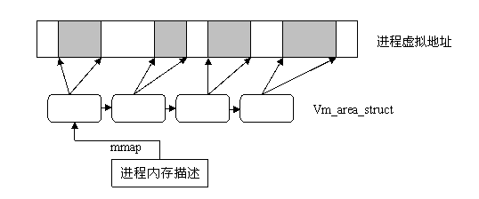
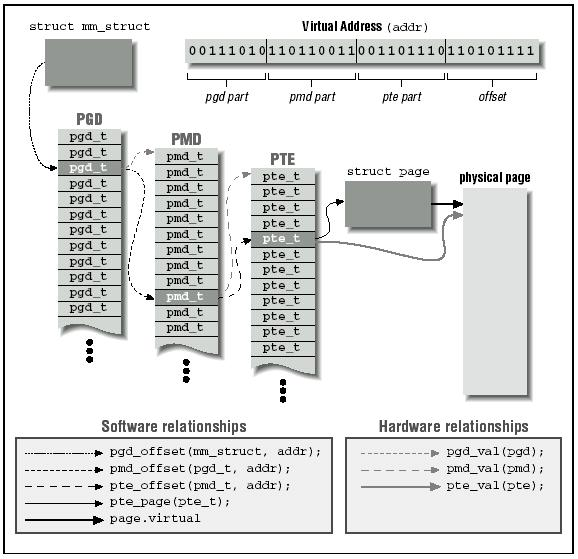
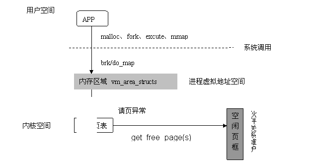
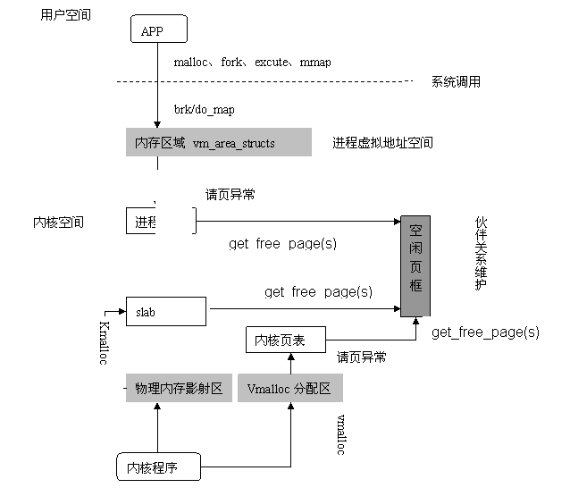
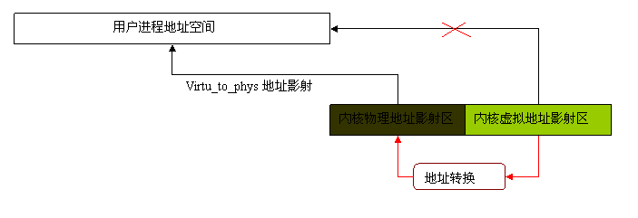

## 摘要

本章首先以应用程序开发者的角度审视Linux的进程内存管理，在此基础上逐步深入到内核中讨论系统物理内存管理和内核内存的使用方法。力求从外到内、水到渠成地引导网友分析Linux的内存管理与使用。在本章最后，我们给出一个内存映射的实例，帮助网友们理解内核内存管理与用户内存管理之间的关系，希望大家最终能驾驭Linux内存管理。

## 前言

内存管理一向是所有操作系统书籍不惜笔墨重点讨论的内容，无论市面上或是网上都充斥着大量涉及内存管理的教材和资料。因此，我们这里所要写的Linux内存管理采取避重就轻的策略，从理论层面就不去班门弄斧，贻笑大方了。我们最想做的和可能做到的是从开发者的角度谈谈对内存管理的理解，最终目的是把我们在内核开发中使用内存的经验和对Linux内存管理的认识与大家共享。

当然，这其中我们也会涉及到一些诸如段页等内存管理的基本理论，但我们的目的不是为了强调理论，而是为了指导理解开发中的实践，所以仅仅点到为止，不做深究。

遵循“理论来源于实践”的“教条”，我们先不必一下子就钻入内核里去看系统内存到底是如何管理，那样往往会让你陷入似懂非懂的窘境（我当年就犯了这个错误！）。所以最好的方式是先从外部（用户编程范畴）来观察进程如何使用内存，等到大家对内存的使用有了较直观的认识后，再深入到内核中去学习内存如何被管理等理论知识。最后再通过一个实例编程将所讲内容融会贯通。

## 进程与内存

### 进程如何使用内存？

毫无疑问，所有进程（执行的程序）都必须占用一定数量的内存，它或是用来存放从磁盘载入的程序代码，或是存放取自用户输入的数据等等。不过进程对这些内存的管理方式因内存用途不一而不尽相同，有些内存是事先静态分配和统一回收的，而有些却是按需要动态分配和回收的。

对任何一个普通进程来讲，它都会涉及到5种不同的数据段。稍有编程知识的朋友都能想到这几个数据段中包含有“程序代码段”、“程序数据段”、“程序堆栈段”等。不错，这几种数据段都在其中，但除了以上几种数据段之外，进程还另外包含两种数据段。下面我们来简单归纳一下进程对应的内存空间中所包含的5种不同的数据区。

**代码段**：代码段是用来存放可执行文件的操作指令，也就是说是它是可执行程序在内存中的镜像。代码段需要防止在运行时被非法修改，所以只准许读取操作，而不允许写入（修改）操作——它是不可写的。

**数据段**：数据段用来存放可执行文件中已初始化全局变量，换句话说就是存放程序静态分配【注释1】的变量和全局变量。

**BSS段【注释2】**：BSS段包含了程序中未初始化的全局变量，在内存中 bss段全部置零。

**堆（heap）**：堆是用于存放进程运行中被动态分配的内存段，它的大小并不固定，可动态扩张或缩减。当进程调用malloc等函数分配内存时，新分配的内存就被动态添加到堆上（堆被扩张）；当利用free等函数释放内存时，被释放的内存从堆中被剔除（堆被缩减）

**栈**：栈是用户存放程序临时创建的局部变量，也就是说我们函数括弧“{}”中定义的变量（但不包括static声明的变量，static意味着在数据段中存放变量）。除此以外，在函数被调用时，其参数也会被压入发起调用的进程栈中，并且待到调用结束后，函数的返回值也会被存放回栈中。由于栈的先进先出特点，所以栈特别方便用来保存/恢复调用现场。从这个意义上讲，我们可以把堆栈看成一个寄存、交换临时数据的内存区。

### 进程如何组织这些区域？

上述几种内存区域中数据段、BSS和堆通常是被连续存储的——内存位置上是连续的，而代码段和栈往往会被独立存放。有趣的是，堆和栈两个区域关系很“暧昧”，他们一个向下“长”（i386体系结构中栈向下、堆向上），一个向上“长”，相对而生。但你不必担心他们会碰头，因为他们之间间隔很大（到底大到多少，你可以从下面的例子程序计算一下），绝少有机会能碰到一起。

下图简要描述了进程内存区域的分布：


“事实胜于雄辩”，我们用一个小例子（原形取自《User-Level Memory Management》）来展示上面所讲的各种内存区的差别与位置。

```c
#include<stdio.h>
#include<malloc.h>
#include<unistd.h>

int bss_var;
int data_var0=1;
int main(int argc,char **argv)
{
    printf("below are addresses of types of process's mem\n");
    printf("Text location:\n");
    printf("\tAddress of main(Code Segment):%p\n",main);
    printf("____________________________\n");
    int stack_var0=2;
    printf("Stack Location:\n");
    printf("\tInitial end of stack:%p\n",&stack_var0);
    int stack_var1=3;
    printf("\tnew end of stack:%p\n",&stack_var1);
    printf("____________________________\n");
    printf("Data Location:\n");
    printf("\tAddress of data_var(Data Segment):%p\n",&data_var0);
    static int data_var1=4;
    printf("\tNew end of data_var(Data Segment):%p\n",&data_var1);
    printf("____________________________\n");
    printf("BSS Location:\n");
    printf("\tAddress of bss_var:%p\n",&bss_var);
    printf("____________________________\n");
    char *b = sbrk((ptrdiff_t)0);
    printf("Heap Location:\n");
    printf("\tInitial end of heap:%p\n",b);
    brk(b+4);
    b=sbrk((ptrdiff_t)0);
	printf("\tNew end of heap:%p\n",b);
	return 0;
}
```

它的结果如下:

```
below are addresses of types of process's mem

Text location:

   Address of main(Code     Segment):0x8048388

____________________________

Stack Location:

   Initial end of stack:0xbffffab4

   new end of     stack:0xbffffab0

____________________________

Data Location:

   Address of data_var(Data Segment):0x8049758

   New end of data_var(Data Segment):0x804975c

____________________________

BSS Location:

   Address of bss_var:0x8049864

____________________________

Heap Location:

   Initial end of heap:0x8049868

   New end of heap:0x804986c
```

利用size命令也可以看到程序的各段大小，比如执行size example会得到:

```
text data bss dec hex filename 

1654 280       8 1942 796 example
```

但这些数据是程序编译的静态统计，而上面显示的是进程运行时的动态值，但两者是对应的。


通过前面的例子，我们对进程使用的逻辑内存分布已先睹为快。这部分我们就继续进入操作系统内核看看，进程对内存具体是如何进行分配和管理的。

从用户向内核看，所使用的内存表象形式会依次经历“逻辑地址”——“线性地址”——“物理地址”几种形式（关于几种地址的解释在前面已经讲述了）。逻辑地址经段机制转化成线性地址；线性地址又经过页机制转化为物理地址。（但是我们要知道Linux系统虽然保留了段机制，但是将所有程序的段地址都定死为0-4G，所以虽然逻辑地址和线性地址是两种不同的地址空间，但在Linux中逻辑地址就等于线性地址，它们的值是一样的）。沿着这条线索，我们所研究的主要问题也就集中在下面几个问题。

1. 进程空间地址如何管理？

2. 进程地址如何映射到物理内存？

3. 物理内存如何被管理？

以及由上述问题引发的一些子问题。如系统虚拟地址分布；内存分配接口；连续内存分配与非连续内存分配等。

 

## 进程内存空间

Linux操作系统采用虚拟内存管理技术，使得每个进程都有各自互不干涉的进程地址空间。该空间是块大小为4G的线性虚拟空间，用户所看到和接触到的都是该虚拟地址，无法看到实际的物理内存地址。利用这种虚拟地址不但能起到保护操作系统的效果（用户不能直接访问物理内存），而且更重要的是，用户程序可使用比实际物理内存更大的地址空间（具体的原因请看硬件基础部分）。

在讨论进程空间细节前，这里先要澄清下面几个问题：

- 第一、4G的进程地址空间被人为的分为两个部分——用户空间与内核空间。用户空间从0到3G（0xC0000000），内核空间占据3G到4G。用户进程通常情况下只能访问用户空间的虚拟地址，不能访问内核空间虚拟地址。只有用户进程进行系统调用（代表用户进程在内核态执行）等时刻可以访问到内核空间。

- 第二、用户空间对应进程，所以每当进程切换，用户空间就会跟着变化；而内核空间是由内核负责映射，它并不会跟着进程改变，是固定的。内核空间地址有自己对应的页表（init_mm.pgd），用户进程各自有不同的页表。

- 第三、每个进程的用户空间都是完全独立、互不相干的。不信的话，你可以把上面的程序同时运行10次（当然为了同时运行，让它们在返回前一同睡眠100秒吧），你会看到10个进程占用的线性地址一模一样。

 

### 进程内存管理

进程内存管理的对象是进程线性地址空间上的内存镜像，这些内存镜像其实就是进程使用的虚拟内存区域（memory region）。进程虚拟空间是个32或64位的“平坦”（独立的连续区间）地址空间（空间的具体大小取决于体系结构）。要统一管理这么大的平坦空间可绝非易事，为了方便管理，虚拟空间被划分为许多大小可变的(但必须是4096的倍数)内存区域，这些区域在进程线性地址中像停车位一样有序排列。这些区域的划分原则是“将访问属性一致的地址空间存放在一起”，所谓访问属性在这里无非指的是“可读、可写、可执行等”。

如果你要查看某个进程占用的内存区域，可以使用命令cat /proc/<pid>/maps获得（pid是进程号，你可以运行上面我们给出的例子——./example &;pid便会打印到屏幕），你可以发现很多类似于下面的数字信息。

由于程序example使用了动态库，所以除了example本身使用的的内存区域外，还会包含那些动态库使用的内存区域（区域顺序是：代码段、数据段、bss段）。

我们下面只抽出和example有关的信息，除了前两行代表的代码段和数据段外，最后一行是进程使用的栈空间。

\-------------------------------------------------------------------------------------------------------------------------------------

08048000 - 08049000 r-xp 00000000 03:03 439029                               /home/mm/src/example

08049000 - 0804a000 rw-p 00000000 03:03 439029                               /home/mm/src/example

……………

bfffe000 - c0000000 rwxp ffff000 00:00 0 

\--------------------------------------------------------------------------------------------------------------------------------------

每行数据格式如下：

（内存区域）开始－结束 访问权限  偏移  主设备号：次设备号 i节点  文件。

注意，你一定会发现进程空间只包含三个内存区域，似乎没有上面所提到的堆、bss等，其实并非如此，程序内存段和进程地址空间中的内存区域是种模糊对应，也就是说，堆、bss、数据段（初始化过的）都在进程空间中由数据段内存区域表示。


在Linux内核中对应进程内存区域的数据结构是: vm_area_struct, 内核将每个内存区域作为一个单独的内存对象管理，相应的操作也都一致。采用面向对象方法使VMA结构体可以代表多种类型的内存区域－－比如内存映射文件或进程的用户空间栈等，对这些区域的操作也都不尽相同。

vm_area_strcut结构比较复杂，关于它的详细结构请参阅相关资料。我们这里只对它的组织方法做一点补充说明。vm_area_struct是描述进程地址空间的基本管理单元，对于一个进程来说往往需要多个内存区域来描述它的虚拟空间，如何关联这些不同的内存区域呢？大家可能都会想到使用链表，的确vm_area_struct结构确实是以链表形式链接，不过为了方便查找，内核又以红黑树（以前的内核使用平衡树）的形式组织内存区域，以便降低搜索耗时。并存的两种组织形式，并非冗余：链表用于需要遍历全部节点的时候用，而红黑树适用于在地址空间中定位特定内存区域的时候。内核为了内存区域上的各种不同操作都能获得高性能，所以同时使用了这两种数据结构。

下图反映了进程地址空间的管理模型：





进程的地址空间对应的描述结构是“内存描述符结构”,它表示进程的全部地址空间，——包含了和进程地址空间有关的全部信息，其中当然包含进程的内存区域。

### 进程内存的分配与回收

创建进程fork()、程序载入execve()、映射文件mmap()、动态内存分配malloc()/brk()等进程相关操作都需要分配内存给进程。不过这时进程申请和获得的还不是实际内存，而是虚拟内存，准确的说是“内存区域”。进程对内存区域的分配最终都会归结到do_mmap（）函数上来（brk调用被单独以系统调用实现，不用do_mmap()），

内核使用do_mmap()函数创建一个新的线性地址区间。但是说该函数创建了一个新VMA并不非常准确，因为如果创建的地址区间和一个已经存在的地址区间相邻，并且它们具有相同的访问权限的话，那么两个区间将合并为一个。如果不能合并，那么就确实需要创建一个新的VMA了。但无论哪种情况， do_mmap()函数都会将一个地址区间加入到进程的地址空间中－－无论是扩展已存在的内存区域还是创建一个新的区域。

同样，释放一个内存区域应使用函数do_ummap()，它会销毁对应的内存区域。

### 如何由虚变实！

​    从上面已经看到进程所能直接操作的地址都为虚拟地址。当进程需要内存时，从内核获得的仅仅是虚拟的内存区域，而不是实际的物理地址，进程并没有获得物理内存（物理页面——页的概念请大家参考硬件基础一章），获得的仅仅是对一个新的线性地址区间的使用权。实际的物理内存只有当进程真的去访问新获取的虚拟地址时，才会由“请求页机制”产生“缺页”异常，从而进入分配实际页面的例程。

该异常是虚拟内存机制赖以存在的基本保证——它会告诉内核去真正为进程分配物理页，并建立对应的页表，这之后虚拟地址才实实在在地映射到了系统的物理内存上。（当然，如果页被换出到磁盘，也会产生缺页异常，不过这时不用再建立页表了）

这种请求页机制把页面的分配推迟到不能再推迟为止，并不急于把所有的事情都一次做完（这种思想有点像设计模式中的代理模式（proxy））。之所以能这么做是利用了内存访问的“局部性原理”，请求页带来的好处是节约了空闲内存，提高了系统的吞吐率。要想更清楚地了解请求页机制，可以看看《深入理解linux内核》一书。

这里我们需要说明在内存区域结构上的nopage操作。当访问的进程虚拟内存并未真正分配页面时，该操作便被调用来分配实际的物理页，并为该页建立页表项。在最后的例子中我们会演示如何使用该方法。

 

 

## 系统物理内存管理  

虽然应用程序操作的对象是映射到物理内存之上的虚拟内存，但是处理器直接操作的却是物理内存。所以当应用程序访问一个虚拟地址时，首先必须将虚拟地址转化成物理地址，然后处理器才能解析地址访问请求。地址的转换工作需要通过查询页表才能完成，概括地讲，地址转换需要将虚拟地址分段，使每段虚地址都作为一个索引指向页表，而页表项则指向下一级别的页表或者指向最终的物理页面。

每个进程都有自己的页表。进程描述符的pgd域指向的就是进程的页全局目录。下面我们借用《linux设备驱动程序》中的一幅图大致看看进程地址空间到物理页之间的转换关系。

 



 

​     上面的过程说起来简单，做起来难呀。因为在虚拟地址映射到页之前必须先分配物理页——也就是说必须先从内核中获取空闲页，并建立页表。下面我们介绍一下内核管理物理内存的机制。

 

### 物理内存管理（页管理）

Linux内核管理物理内存是通过分页机制实现的，它将整个内存划分成无数个4k（在i386体系结构中）大小的页，从而分配和回收内存的基本单位便是内存页了。利用分页管理有助于灵活分配内存地址，因为分配时不必要求必须有大块的连续内存【注释3】，系统可以东一页、西一页的凑出所需要的内存供进程使用。虽然如此，但是实际上系统使用内存时还是倾向于分配连续的内存块，因为分配连续内存时，页表不需要更改，因此能降低TLB的刷新率（频繁刷新会在很大程度上降低访问速度）。

鉴于上述需求，内核分配物理页面时为了尽量减少不连续情况，采用了“伙伴”关系来管理空闲页面。伙伴关系分配算法大家应该不陌生——几乎所有操作系统方面的书都会提到,我们不去详细说它了，如果不明白可以参看有关资料。这里只需要大家明白Linux中空闲页面的组织和管理利用了伙伴关系，因此空闲页面分配时也需要遵循伙伴关系，最小单位只能是2的幂倍页面大小。内核中分配空闲页面的基本函数是get_free_page/get_free_pages，它们或是分配单页或是分配指定的页面（2、4、8…512页）。

 注意：get_free_page是在内核中分配内存，不同于malloc在用户空间中分配，malloc利用堆动态分配，实际上是调用brk()系统调用，该调用的作用是扩大或缩小进程堆空间（它会修改进程的brk域）。如果现有的内存区域不够容纳堆空间，则会以页面大小的倍数为单位，扩张或收缩对应的内存区域，但brk值并非以页面大小为倍数修改，而是按实际请求修改。因此Malloc在用户空间分配内存可以以字节为单位分配,但内核在内部仍然会是以页为单位分配的。

   另外,需要提及的是，物理页在系统中由页结构struct page描述，系统中所有的页面都存储在数组mem_map[]中，可以通过该数组找到系统中的每一页（空闲或非空闲）。而其中的空闲页面则可由上述提到的以伙伴关系组织的空闲页链表（free_area[MAX_ORDER]）来索引。




 

### 内核内存使用

**Slab**

​    所谓尺有所长，寸有所短。以页为最小单位分配内存对于内核管理系统中的物理内存来说的确比较方便，但内核自身最常使用的内存却往往是很小（远远小于一页）的内存块——比如存放文件描述符、进程描述符、虚拟内存区域描述符等行为所需的内存都不足一页。这些用来存放描述符的内存相比页面而言，就好比是面包屑与面包。一个整页中可以聚集多个这些小块内存；而且这些小块内存块也和面包屑一样频繁地生成/销毁。

  为了满足内核对这种小内存块的需要，Linux系统采用了一种被称为slab分配器的技术。Slab分配器的实现相当复杂，但原理不难，其核心思想就是“存储池【注释4】”的运用。内存片段（小块内存）被看作对象，当被使用完后，并不直接释放而是被缓存到“存储池”里，留做下次使用，这无疑避免了频繁创建与销毁对象所带来的额外负载。

Slab技术不但避免了内存内部分片（下文将解释）带来的不便（引入Slab分配器的主要目的是为了减少对伙伴系统分配算法的调用次数——频繁分配和回收必然会导致内存碎片——难以找到大块连续的可用内存），而且可以很好地利用硬件缓存提高访问速度。

​    Slab并非是脱离伙伴关系而独立存在的一种内存分配方式，slab仍然是建立在页面基础之上，换句话说，Slab将页面（来自于伙伴关系管理的空闲页面链表）撕碎成众多小内存块以供分配，slab中的对象分配和销毁使用kmem_cache_alloc与kmem_cache_free。


**Kmalloc**

Slab分配器不仅仅只用来存放内核专用的结构体，它还被用来处理内核对小块内存的请求。当然鉴于Slab分配器的特点，一般来说内核程序中对小于一页的小块内存的请求才通过Slab分配器提供的接口Kmalloc来完成（虽然它可分配32 到131072字节的内存）。从内核内存分配的角度来讲，kmalloc可被看成是get_free_page（s）的一个有效补充，内存分配粒度更灵活了。

有兴趣的话，可以到/proc/slabinfo中找到内核执行现场使用的各种slab信息统计，其中你会看到系统中所有slab的使用信息。从信息中可以看到系统中除了专用结构体使用的slab外，还存在大量为Kmalloc而准备的Slab（其中有些为dma准备的）。

 

 

**内核非连续内存分配（Vmalloc）**

  

伙伴关系也好、slab技术也好，从内存管理理论角度而言目的基本是一致的，它们都是为了防止“分片”，不过分片又分为外部分片和内部分片之说，所谓内部分片是说系统为了满足一小段内存区（连续）的需要，不得不分配了一大区域连续内存给它，从而造成了空间浪费；外部分片是指系统虽有足够的内存，但却是分散的碎片，无法满足对大块“连续内存”的需求。无论何种分片都是系统有效利用内存的障碍。slab分配器使得一个页面内包含的众多小块内存可独立被分配使用，避免了内部分片，节约了空闲内存。伙伴关系把内存块按大小分组管理，一定程度上减轻了外部分片的危害，因为页框分配不在盲目，而是按照大小依次有序进行，不过伙伴关系只是减轻了外部分片，但并未彻底消除。你自己比划一下多次分配页面后，空闲内存的剩余情况吧。

所以避免外部分片的最终思路还是落到了如何利用不连续的内存块组合成“看起来很大的内存块”——这里的情况很类似于用户空间分配虚拟内存，内存逻辑上连续，其实映射到并不一定连续的物理内存上。Linux内核借用了这个技术，允许内核程序在内核地址空间中分配虚拟地址，同样也利用页表（内核页表）将虚拟地址映射到分散的内存页上。以此完美地解决了内核内存使用中的外部分片问题。内核提供vmalloc函数分配内核虚拟内存，该函数不同于kmalloc，它可以分配较Kmalloc大得多的内存空间（可远大于128K，但必须是页大小的倍数），但相比Kmalloc来说,Vmalloc需要对内核虚拟地址进行重映射，必须更新内核页表，因此分配效率上要低一些（用空间换时间）

与用户进程相似,内核也有一个名为init_mm的mm_strcut结构来描述内核地址空间，其中页表项pdg=swapper_pg_dir包含了系统内核空间（3G-4G）的映射关系。因此vmalloc分配内核虚拟地址必须更新内核页表，而kmalloc或get_free_page由于分配的连续内存，所以不需要更新内核页表。





vmalloc分配的内核虚拟内存与kmalloc/get_free_page分配的内核虚拟内存位于不同的区间，不会重叠。因为内核虚拟空间被分区管理，各司其职。进程空间地址分布从０到３G(其实是到PAGE_OFFSET, 在0x86中它等于0xC0000000)，从3G到vmalloc_start这段地址是物理内存映射区域（该区域中包含了内核镜像、物理页面表mem_map等等）比如我使用的系统内存是64M(可以用free看到)，那么(3G——3G+64M)这片内存就应该映射到物理内存，而vmalloc_start位置应在3G+64M附近（说"附近"因为是在物理内存映射区与vmalloc_start期间还会存在一个8M大小的gap来防止跃界）,vmalloc_end的位置接近4G(说"接近"是因为最后位置系统会保留一片128k大小的区域用于专用页面映射，还有可能会有高端内存映射区，这些都是细节，这里我们不做纠缠)。

 

 

上图是内存分布的模糊轮廓

 

　  由get_free_page或Kmalloc函数所分配的连续内存都陷于物理映射区域，所以它们返回的内核虚拟地址和实际物理地址仅仅是相差一个偏移量（PAGE_OFFSET），你可以很方便的将其转化为物理内存地址，同时内核也提供了virt_to_phys（）函数将内核虚拟空间中的物理映射区地址转化为物理地址。要知道，物理内存映射区中的地址与内核页表是有序对应的，系统中的每个物理页面都可以找到它对应的内核虚拟地址（在物理内存映射区中的）。

而vmalloc分配的地址则限于vmalloc_start与vmalloc_end之间。每一块vmalloc分配的内核虚拟内存都对应一个vm_struct结构体（可别和vm_area_struct搞混，那可是进程虚拟内存区域的结构），不同的内核虚拟地址被4k大小的空闲区间隔，以防止越界——见下图）。与进程虚拟地址的特性一样，这些虚拟地址与物理内存没有简单的位移关系，必须通过内核页表才可转换为物理地址或物理页。它们有可能尚未被映射，在发生缺页时才真正分配物理页面。


 

这里给出一个小程序帮助大家认清上面几种分配函数所对应的区域。

```c
#include<linux/module.h>
#include<linux/slab.h>
#include<linux/vmalloc.h>
unsigned char *pagemem;
unsigned char *kmallocmem;
unsigned char *vmallocmem;
int init_module(void)
{
     pagemem = get_free_page(0);
     printk("<1>pagemem=%s",pagemem);
     kmallocmem = kmalloc(100,0);
     printk("<1>kmallocmem=%s",kmallocmem);
     vmallocmem = vmalloc(1000000);
     printk("<1>vmallocmem=%s",vmallocmem);
}

void cleanup_module(void)
{
     free_page(pagemem);
     kfree(kmallocmem);
     vfree(vmallocmem);
}
```


## 实例

内存映射(mmap)是Linux操作系统的一个很大特色，它可以将系统内存映射到一个文件（设备）上，以便可以通过访问文件内容来达到访问内存的目的。这样做的最大好处是提高了内存访问速度，并且可以利用文件系统的接口编程（设备在Linux中作为特殊文件处理）访问内存，降低了开发难度。许多设备驱动程序便是利用内存映射功能将用户空间的一段地址关联到设备内存上，无论何时，只要内存在分配的地址范围内进行读写，实际上就是对设备内存的访问。同时对设备文件的访问也等同于对内存区域的访问，也就是说，通过文件操作接口可以访问内存。Linux中的X服务器就是一个利用内存映射达到直接高速访问视频卡内存的例子。

熟悉文件操作的朋友一定会知道file_operations结构中有mmap方法，在用户执行mmap系统调用时，便会调用该方法来通过文件访问内存——不过在调用文件系统mmap方法前，内核还需要处理分配内存区域（vma_struct）、建立页表等工作。对于具体映射细节不作介绍了，需要强调的是,建立页表可以采用remap_page_range方法一次建立起所有映射区的页表，或利用vma_struct的nopage方法在缺页时现场一页一页的建立页表。第一种方法相比第二种方法简单方便、速度快， 但是灵活性不高。一次调用所有页表便定型了，不适用于那些需要现场建立页表的场合——比如映射区需要扩展或下面我们例子中的情况。

 

我们这里的实例希望利用内存映射，将系统内核中的一部分虚拟内存映射到用户空间，以供应用程序读取——你可利用它进行内核空间到用户空间的大规模信息传输。因此我们将试图写一个虚拟字符设备驱动程序，通过它将系统**内核空间****映射****到用户空间**——将内核虚拟内存映射到用户虚拟地址。从上一节已经看到Linux内核空间中包含两种虚拟地址：一种是物理和逻辑都连续的物理内存映射虚拟地址；另一种是逻辑连续但非物理连续的vmalloc分配的内存虚拟地址。我们的例子程序将演示把vmalloc分配的内核虚拟地址映射到用户地址空间的全过程。

程序里主要应解决两个问题：

第一是如何将vmalloc分配的内核虚拟内存正确地转化成物理地址？

因为内存映射先要获得被映射的物理地址，然后才能将其映射到要求的用户虚拟地址上。我们已经看到内核物理内存映射区域中的地址可以被内核函数virt_to_phys转换成实际的物理内存地址，但对于vmalloc分配的内核虚拟地址无法直接转化成物理地址，所以我们必须对这部分虚拟内存格外“照顾”——先将其转化成**内核物理内存**映射区域中的地址，然后在用virt_to_phys变为物理地址。

转化工作需要进行如下步骤：

a)          找到vmalloc虚拟内存对应的页表，并寻找到对应的页表项。

b)         获取页表项对应的页面指针

c)         通过页面得到对应的内核物理内存映射区域地址**。** 

如下图所示：





第二是当访问vmalloc分配区时，如果发现虚拟内存尚未被映射到物理页，则需要处理“缺页异常”。因此需要我们实现内存区域中的nopaga操作，以能返回被映射的物理页面指针，在我们的实例中就是返回上面过程中的内核物理内存映射区域中的地址**。**由于vmalloc分配的虚拟地址与物理地址的对应关系并非分配时就可确定，必须在缺页现场建立页表，因此这里不能使用remap_page_range方法，只能用vma的nopage方法一页一页的建立。

 

 

**程序组成**

map_driver.c，它是以模块形式加载的虚拟字符驱动程序。该驱动负责将一定长的内核虚拟地址(vmalloc分配的)映射到设备文件上。其中主要的函数有——vaddress_to_kaddress（）负责对vmalloc分配的地址进行页表解析,以找到对应的内核物理映射地址（kmalloc分配的地址）；map_nopage()负责在进程访问一个当前并不存在的VMA页时，寻找该地址对应的物理页，并返回该页的指针。

test.c 它利用上述驱动模块对应的设备文件在用户空间读取读取内核内存。结果可以看到内核虚拟地址的内容（ok!），被显示在了屏幕上。

 

**执行步骤**

编译map_driver.c为map_driver.o模块,具体参数见Makefile

加载模块 ：insmod map_driver.o

生成对应的设备文件 

1 在/proc/devices下找到map_driver对应的设备命和设备号：grep mapdrv /proc/devices 

2 建立设备文件mknod  mapfile c 254  0  （在我的系统里设备号为254）

​    利用maptest读取mapfile文件，将取自内核的信息打印到屏幕上。

 

全部程序下载 [mmap.tar ](img/mmap.tar )（感谢Martin Frey，该程序的主体出自他的灵感）

 

------

[[1\]](http://wwww.kerneltravel.net/journal/v/mem.htm#_ftnref1) 静态分配内存就是编译器在编译程序的时候根据源程序来分配内存. 动态分配内存就是在程序编译之后, 运行时调用运行时刻库函数来分配内存的. 静态分配由于是在程序运行之前,所以速度快, 效率高, 但是局限性大. 动态分配在程序运行时执行, 所以速度慢, 但灵活性高.

[[2\]](http://wwww.kerneltravel.net/journal/v/mem.htm#_ftnref2)术语"BSS"已经有些年头了，它是*block started by symbol*的缩写。因为未初始化的变量没有对应的值,所以并不需要存储在可执行对象中。但是因为C标准强制规定未初始化的全局变量要被赋予特殊的默认值(基本上是0值)，所以内核要从可执行代码装入变量(未赋值的)到内存中，然后将零页映射到该片内存上，于是这些未初始化变量就被赋予了0值。这样做避免了在目标文件中进行显式地初始化，减少空间浪费（来自《Linux内核开发》）

[[3\]](http://wwww.kerneltravel.net/journal/v/mem.htm#_ftnref3) 还有些情况必须要求内存连续，比如DMA传输中使用的内存，由于不涉及页机制所以必须连续分配。

[[4\]](http://wwww.kerneltravel.net/journal/v/mem.htm#_ftnref4) 这种存储池的思想在计算机科学里广泛应用，比如数据库连接池、内存访问池等等。