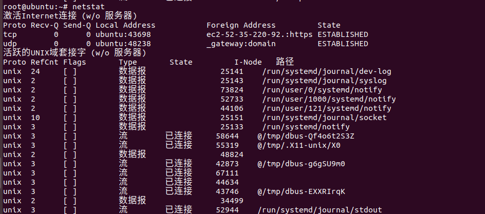
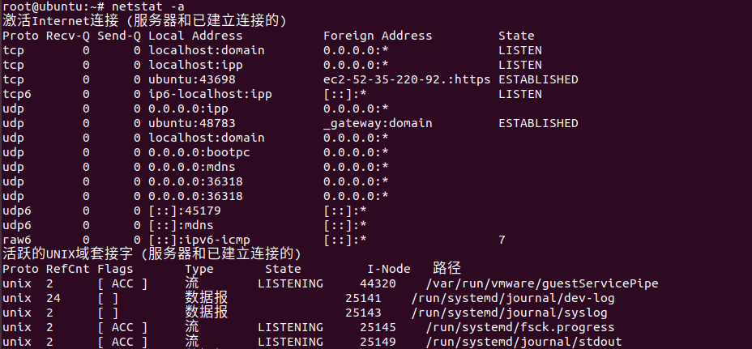
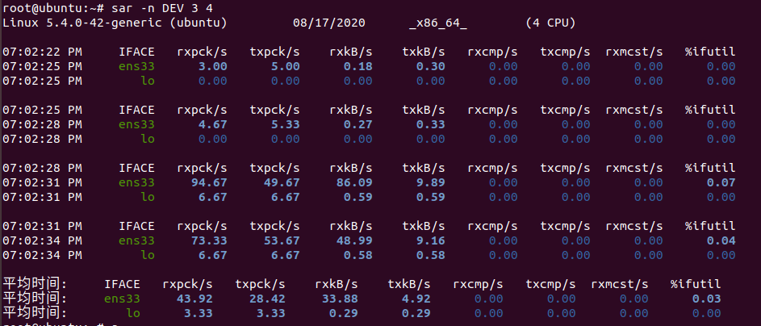
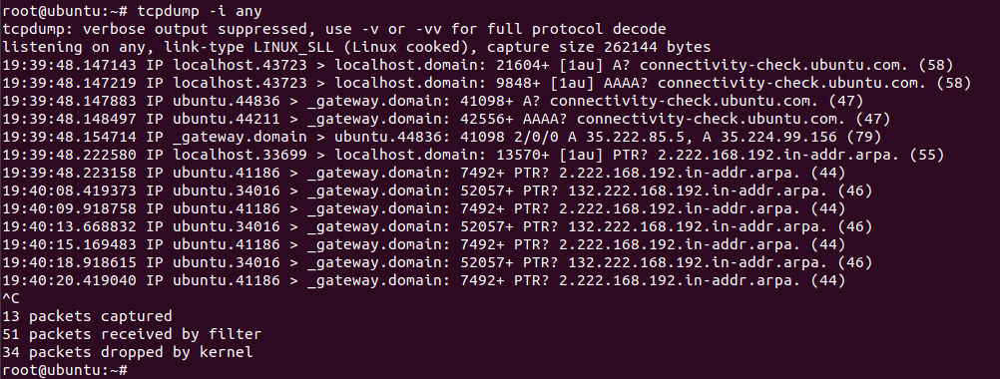

通过学习《BPF Performance Tools》，对Tradition Tools涉及到的常用的网络性能工具进行一下总结和列举使用。传统的性能工具可以显示数据包速率、各种事件和吞吐量的内核统计信息，并显示打开的套接字的状态。除了解决问题之外，传统工具还可以为指导我们进一步使用BPF工具提供线索。
根据它们的源和度量类型、内核统计信息或包捕获对它们进行了分类如下，本文先对其中使用频繁的五个总结并举例。


# 1. SS

## 1.1 简介

s命令用于显示socket状态. 他可以显示PACKET sockets, TCP sockets, UDP sockets, DCCP sockets, RAW sockets, Unix domain sockets等等统计. 它比其他工具展示等多tcp和state信息. 它是一个非常实用、快速、有效的跟踪IP连接和sockets的新工具.SS命令可以提供如下信息：
所有的TCP sockets
所有的UDP sockets
所有ssh/ftp/ttp/https持久连接
所有连接到Xserver的本地进程
使用state（例如：connected, synchronized, SYN-RECV, SYN-SENT,TIME-WAIT）、地址、端口过滤
所有的state FIN-WAIT-1 tcpsocket连接以及更多

## 1.2 常用ss命令

```
 ss -l显示本地打开的所有端口
 ss -pl显示每个进程具体打开的socket
 ss -t -a显示所有tcp socket
 ss -u-a显示所有的UDP Socekt
 ss -o state established '( dport = :smtp or sport = :smtp )’显示所有已建立的SMTP连接
 ss -o state established '(dport = :http or sport = :http)’显示所有已建立的HTTP连接
 ss -x src /tmp/.X11-unix/*找出所有连接X服务器的进程
 ss -s列出当前socket详细信息:
```

查看本地打开的端口：


显示所有的tcp socket:


# 2. IP

## 2.1 IP的命令格式

IP [ OPTIONS ] OBJECT { COMMAND | help }

OPTIONS := { -V[ersion] | -s[tatistics] | -r[esolve] | -f[amily] { inet | inet6 | ipx | dnet | link } | -o[neline] | -n[etns] name }
OBJECT := { link | addr | addrlabel | route | rule | neigh | ntable | tunnel | tuntap | maddr | mroute | mrule | monitor | xfrm | netns | l2tp | tcp_metrics }

OPTION
-V | -Version Print the version of the ip utility and exit.
-b | batch 从提供的文件或标准输入读取并执行命令。
-s | -stats | -statistics 输出更多信息

## 2.2 常见的命令展示

  ip neighbor show  # 查看 ARP 表

  ip neighbor add 10.1.1.1 lladdr 0:0:0:0:0:1 dev eth0 nud permit # 添加一条 ARP 相关表项

```
 ip neighbor change 10.1.1.1 dev eth0 nud reachable  #修改相关表项
 ip neighbor del 10.1.1.1 dev eth0  #删除一条表项
 ip neighbor flush  #清除整个ARP 表
 ip neighbor add 10.1.1.1 lladdr 0:0:0:0:0:1 dev eth0 nud permit # 添加一条ARP相关表项
 ip neighbor change 10.1.1.1 dev eth0 nud reachable #修改相关表项
 ip neighbor del 10.1.1.1 dev eth0   #删除一条表项
 ip neighbor flush   # 清除整个ARP 表
```

部分命令展示：
*查看本机ARP表：*


*清除ARP表*


ip link set 命令组 （接口硬件操作相关）

```
    ip -s -s link show # 显示所有接口详细信息
    ip -s -s link show eth1.11 # 显示单独接口信息
    ip link set dev eth1 up # 启动设备，相当于 ifconfig eth1 up
    ip link set dev eth1 down # 停止设备，相当于 ifconfig eth1 down
    ip link set dev eth1 txqueuelen 100 # 改变设备传输队列长度
    ip link set dev eth1 mtu 1200  # 改变 MTU 长度
    ip link set dev eth1 address 00:00:00:AA:BB:CC # 改变 MAC 地址
    ip link set dev eth1 name myeth  #接口名变更
```

部分命令展示：

查看ens33接口的所有信息


修改ens33接口的MTU，并进行查看修改后的结果


ip address （接口地址操作相关）

```bash
ip -6 address del 2000:ff04::2/64 dev eth1.11  # 删除接口上指定地址
ip -6 address flush dev eth1.11   # 删除接口上所有地址    
ip -6 address show <interface name>  # 查看接口 ipv6 地址
ip address show <interface name>  # 查看接口 IP 地址，包括 4/6 2个版本的
ip address add 192.168.1.1 broadcast # 设置接口地址和广播地址，+ 表示让系统自动计算
ip address add 192.68.1.1 dev eth1 label eth1.1 # 设置接口别名，注意别和 ip link set ... name 命令混淆
ip address add 192.68.1.1 dev eth1 scope global  #设置接口领域，也就是可以接受的包的范围
```

# 3. netstat

## 3.1 简介

在linux一般使用netstat来查看系统端口使用情况，netstat命令是一个监控TCP/IP网络的非常有用的工具，它可以显示路由表、实际的网络连接以及每一个网络接口设备的；netstat命令的功能是显示网络连接、路由表和网络接口信息，可以让用户得知目前都有哪些网络连接正在运作。

## 3.2 命令格式

netstat [选项]
   命令中各选项的含义如下：
   -a 显示所有socket，包括正在监听的。
   -c 每隔1秒就重新显示一遍，直到用户中断它。
   -i 显示所有网络接口的信息，格式同“ifconfig -e”。
   -n 以网络IP地址代替名称，显示出网络连接情形。
   -r 显示核心路由表，格式同“route -e”。
   -t 显示TCP协议的连接情况。
   -u 显示UDP协议的连接情况。
   -v 显示正在进行的工作。

## 3.3 常用命令展示

查看所有的服务端口并显示对应的服务程序名


查看已经连接的服务端口（ESTABLISHED）



查看所有的服务端口（LISTEN，ESTABLISHED）



当我们使用　netstat -apn　查看网络连接的时候，会发现很多类似下面的内容：

Proto Recv-Q Send-Q Local Address Foreign Address State PID/Program name
tcp 0 52 218.104.81.152：7710 211.100.39.250：29488 ESTABLISHED 6111/1
显示这台服务器开放了7710端口，那么这个端口属于哪个程序呢？我们可以使用　lsof -i ：7710　命令来查询：
COMMAND PID USER FD TYPE DEVICE SIZE NODE NAME

sshd 1990 root 3u IPv4 4836 TCP *：7710 （LISTEN）

这样，我们就知道了7710端口是属于sshd程序的。

# 4. sar

## 4.1 简介与常用命令演示

sar命令包含在sysstat工具包中，提供系统的众多统计数据。其在不同的系统上命令有些差异，这里只总结其在网络数据监控上的参数。

命令：sar –n DEV 1 4

解释:

-n DEV,报告网络设备统计信息,参数还可以是EDEV, NFS, NFSD, SOCK, IP, EIP, ICMP, EICMP, TCP, ETCP, UDP, SOCK6, IP6, EIP6, ICMP6, EICMP6 and UDP6
3 4,每3秒钟取一次值，取四次。



IFACE：LAN接口

rxpck/s：每秒钟接收的数据包

txpck/s：每秒钟发送的数据包

rxbyt/s：每秒钟接收的字节数

txbyt/s：每秒钟发送的字节数

rxcmp/s：每秒钟接收的压缩数据包

txcmp/s：每秒钟发送的压缩数据包

rxmcst/s：每秒钟接收的多播数据包

sar -n SOCK 1 3(针对socket连接进行汇报)


totsck:被使用的socket的总数目

tcpsck:当前正在被使用于TCP的socket数目

udpsck:当前正在被使用于UDP的socket数自

rawsck:当前正在被使用于RAW的socket数目

ip-frag:当前的IP分片的数目

# 5. tcpdump

## 5.1 简介与命令格式介绍

tcpdump是一个运行在命令行下的抓包工具。它允许用户拦截和显示发送或收到过网络连接到该计算机的TCP/IP和其他数据包。tcpdump 适用于
大多数的类Unix系统操作系统(如linux,BSD等)。
tcpdump命令格式及常用参数
Tcpdump的大概形式如下:
例:tcpdump –i eth0 ’port 1111‘ -X -c 3
-X告诉tcpdump命令，需要把协议头和包内容都原原本本的显示出来（tcpdump会以16进制和ASCII的形式显示），这在进行协议分析时是绝对的利器。
tcpdump采用命令行方式，它的命令格式为：
　　tcpdump [ -adeflnNOpqStvx ] [ -c 数量 ] [ -F 文件名 ]
　　　　　　　　　　[ -i 网络接口 ] [ -r 文件名] [ -s snaplen ]
                    [ -T 类型 ] [ -w 文件名 ] [表达式 ]
 tcpdump的选项介绍
　　　-a 　　　将网络地址和广播地址转变成名字；
　　　-d 　　　将匹配信息包的代码以人们能够理解的汇编格式给出；
　　　-dd 　　　将匹配信息包的代码以c语言程序段的格式给出；
　　　-ddd 　　　将匹配信息包的代码以十进制的形式给出；
　　　-e 　　　在输出行打印出数据链路层的头部信息，包括源mac和目的mac，以及网络层的协议；
　　　-f 　　　将外部的Internet地址以数字的形式打印出来；
　　　-l 　　　使标准输出变为缓冲行形式；
　　　-n 　　　指定将每个监听到数据包中的域名转换成IP地址后显示，不把网络地址转换成名字；
    -nn：   指定将每个监听到的数据包中的域名转换成IP、端口从应用名称转换成端口号后显示
　　　-t 　　　在输出的每一行不打印时间戳；
　　　-v 　　　输出一个稍微详细的信息，例如在ip包中可以包括ttl和服务类型的信息；
　　　-vv 　　　输出详细的报文信息；
　　　-c 　　　在收到指定的包的数目后，tcpdump就会停止；
　　　-F 　　　从指定的文件中读取表达式,忽略其它的表达式；
　　　-i 　　　指定监听的网络接口；
    -p   将网卡设置为非混杂模式，不能与host或broadcast一起使用
　　　-r 　　　从指定的文件中读取包(这些包一般通过-w选项产生)；
　　　-w 　　　直接将包写入文件中，并不分析和打印出来；
    -s snaplen      snaplen表示从一个包中截取的字节数。0表示包不截断，抓完整的数据包。默认的话 tcpdump 只显示部分数据包,默认68字节。
　　　-T 　　　将监听到的包直接解释为指定的类型的报文，常见的类型有rpc （远程过程调用）和snmp（简单网络管理协议；）
    -X       告诉tcpdump命令，需要把协议头和包内容都原原本本的显示出来（tcpdump会以16进制和ASCII的形式显示），这在进行协议分析时是绝对的利器。

## 5.2 tcpdump过滤语句介绍

可以给tcpdump传送“过滤表达式”来起到网络包过滤的作用，而且可以支持传入单个或多个过滤表达式。

可以通过命令 man pcap-filter 来参考过滤表达式的帮助文档
过滤表达式大体可以分成三种过滤条件，“类型”、“方向”和“协议”，这三种条件的搭配组合就构成了我们的过滤表达式。
关于类型的关键字，主要包括host，net，port, 例如 host 210.45.114.211，指定主机 210.45.114.211，net 210.11.0.0 指明210.11.0.0是一个网络地址，port 21 指明
端口号是21。如果没有指定类型，缺省的类型是host.
关于传输方向的关键字，主要包括src , dst ,dst or src, dst and src ,
这些关键字指明了传输的方向。举例说明，src 210.45.114.211 ,指明ip包中源地址是210.45.114.211, dst net 210.11.0.0 指明目的网络地址是210.11.0.0 。如果没有指明
方向关键字，则缺省是srcor dst关键字。
关于协议的关键字，主要包括 ether,ip,ip6,arp,rarp,tcp,udp等类型。这几个的包的协议内容。如果没有指定任何协议，则tcpdump将会监听所有协议的信息包。

## 5.3 tcpdump命令演示

从所有的网卡中捕获数据包



获取指定IP的数据包


要捕获某个端口或一个范围的数据包

