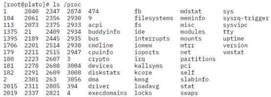
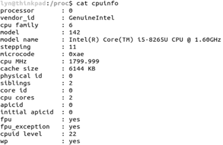
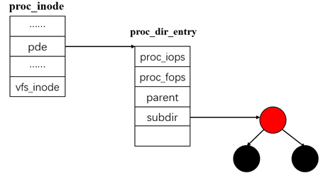
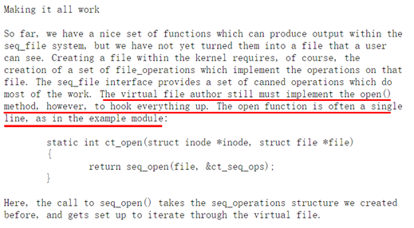
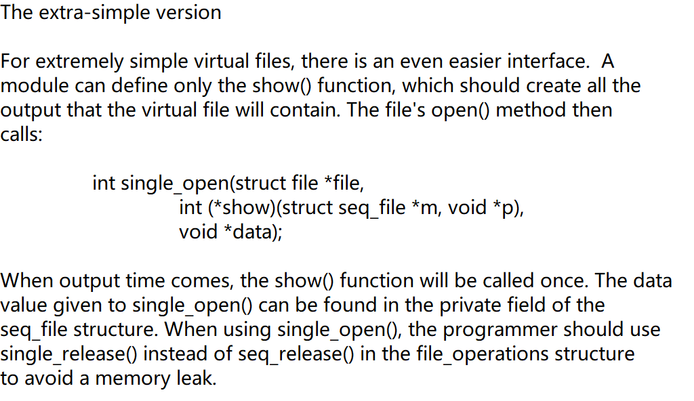

>tcp丢包分析系列文章代码来自谢宝友老师，由西邮陈莉君教授研一学生进行解析，本文由戴君毅整理，梁金荣编辑,贺东升校对。

最初开发` /proc` 文件系统是为了提供有关系统中进程的信息。但是这个文件系统非常有用，` /proc` 文件系统包含了一些目录（用作组织信息的方式）和虚拟文件。虚拟文件可以向用户呈现内核中的一些信息，也可以用作一种从用户空间向内核发送信息的手段。

`/proc`文件系统可以为提供很多信息， 在左边是一系列数字编号，每个实际上都是一个目录，表示系统中的一个进程。由于在Linux中创建的第一个进程是 `init` 进程，因此它的 `process-id` 为 1。



右边的目录包含特定信息，比如`cpuinfo`包含了CPU的信息，`modules`包含了内核模块的信息。



为了解决一些实际问题，我们需要在`/proc`下创建条目捕获信息，使用文件系统通用方法肯定是不行的，需要使用相关API编写内核模块来实现。

在做谢宝友老师写的“TCP丢包分析”实验里，首先就会在`/proc`下创建条目，较为简单，先来看`init`和`exit`：

```c
static int drop_packet_init(void)
{
	int ret;
	struct proc_dir_entry *pe;

	proc_mkdir("mooc", NULL);
	proc_mkdir("mooc/net", NULL);

	ret = -ENOMEM;
	pe = proc_create("mooc/net/drop-packet",
				S_IFREG | 0644,
				NULL,
				&drop_packet_fops);
	if (!pe)
		goto err_proc;

	printk("drop-packet loaded.\n");

	return 0;

err_proc:
	return ret;
}

static void drop_packet_exit(void)
{
	remove_proc_entry("mooc/net/drop-packet", NULL);
	remove_proc_entry("mooc/net", NULL);
	remove_proc_entry("mooc", NULL);
	
	printk("drop-packet unloaded.\n");
}
```

框架还是比较清晰的，需要深入源码来感受一下，第一部分代码：

**struct proc_dir_entry *pe;**


```c
struct proc_dir_entry {
	/*
	 * number of callers into module in progress;
	 * negative -> it's going away RSN
	 */
	atomic_t in_use;
	refcount_t refcnt;
	struct list_head pde_openers;	/* who did ->open, but not ->release */
	/* protects ->pde_openers and all struct pde_opener instances */
	spinlock_t pde_unload_lock;
	struct completion *pde_unload_completion;
	const struct inode_operations *proc_iops;
	const struct file_operations *proc_fops;
	const struct dentry_operations *proc_dops;
	union {
		const struct seq_operations *seq_ops;
		int (*single_show)(struct seq_file *, void *);
	};
	proc_write_t write;
	void *data;
	unsigned int state_size;
	unsigned int low_ino;
	nlink_t nlink;
	kuid_t uid;
	kgid_t gid;
	loff_t size;
	struct proc_dir_entry *parent;
	struct rb_root subdir;
	struct rb_node subdir_node;
	char *name;
	umode_t mode;
	u8 namelen;
	char inline_name[];
} __randomize_layout;
```

结构`proc_dir_entry`定义在`<fs/proc/internal.h>`下，可以称为一个`pde`，在创建一个文件或目录时就会创建一个`pde`来管理它们。而在打开它们的时候，则会创建一个`proc_inode`结构：

```c
struct proc_inode {
	struct pid *pid;
	unsigned int fd;
	union proc_op op;
	struct proc_dir_entry *pde;
	struct ctl_table_header *sysctl;
	struct ctl_table *sysctl_entry;
	struct hlist_node sysctl_inodes;
	const struct proc_ns_operations *ns_ops;
	struct inode vfs_inode;
} __randomize_layout;
```

可以使用`PROC_I`宏，也就是我们熟悉的`container_of`，从虚拟文件系统的`inode`得到`proc_inode`，进而得到`pde`。

```c
static inline struct proc_inode *PROC_I(const struct inode *inode)
{
	return container_of(inode, struct proc_inode, vfs_inode);
}

static inline struct proc_dir_entry *PDE(const struct inode *inode)
{
	return PROC_I(inode)->pde;
}
```

回到`proc_dir_entry`结构，很多信息从字段名字就可以看出，`pde`需要指向创建自己的父`pde`结构,`subdir`的组织方式是红黑树，还需要我们实现操作集以及一些引用计数和命名规则等等。

有意思的是，除了操作集之外还有一个`proc_write_t`，对于一些功能比较简单的`proc`文件，我们只要实现这个函数即可，而不用设置`inode_operations`结构，在注册`proc`文件的时候，会自动为`proc_fops`设置一个缺省的 `file_operations`结构。

此时，我们可以想象以下模型：



**第二部分代码是：**

**proc_mkdir("mooc", NULL);**

**proc_mkdir("mooc/net", NULL);**

**remove_proc_entry("mooc/net", NULL);**

**remove_proc_entry("mooc", NULL);**

易知其功能是在`/proc`下创建和删除条目`mooc/net`，以创建操作为例，看下内核代码如何实现的：

```c
struct proc_dir_entry *proc_mkdir(const char *name,
		struct proc_dir_entry *parent)
{
	return proc_mkdir_data(name, 0, parent, NULL);
}
EXPORT_SYMBOL(proc_mkdir);
```

```c
struct proc_dir_entry *proc_mkdir_data(const char *name, umode_t mode,
		struct proc_dir_entry *parent, void *data)
{
	struct proc_dir_entry *ent;

	if (mode == 0)
		mode = S_IRUGO | S_IXUGO;

	ent = __proc_create(&parent, name, S_IFDIR | mode, 2);
	if (ent) {
		ent->data = data;
		ent->proc_fops = &proc_dir_operations;
		ent->proc_iops = &proc_dir_inode_operations;
		parent->nlink++;
		ent = proc_register(parent, ent);
		if (!ent)
			parent->nlink--;
	}
	return ent;
}
EXPORT_SYMBOL_GPL(proc_mkdir_data);
```

这里逻辑很简单，`proc_mkdir`实际上是`proc_mkdir_data`默认了权限为` S_IRUGO | S_IXUGO`，再调用 `__proc_create`初始化一个局部`pde`，如果成功则初始化操作集，并调用`proc_register`注册这个`pde`到父`pde`下并返回。

`__proc_create`调用`kmem_cache_zalloc`从`cache`中获取空间给`pde`，并且对条目名称进行检查。如果成功，则对名称、模式等属性赋值，设置引用计数并初始化锁。

`__proc_register`接收两个参数，一个父亲`pde`，一个当前`pde`，目的是把当前`pde`挂到父亲名下，前面提到`subdir`的组织形式是红黑树，那么肯定涉及相关代码，来看：

```c
struct proc_dir_entry *proc_create_reg(const char *name, umode_t mode,
		struct proc_dir_entry **parent, void *data)
{
	struct proc_dir_entry *p;

	if ((mode & S_IFMT) == 0)
		mode |= S_IFREG;
	if ((mode & S_IALLUGO) == 0)
		mode |= S_IRUGO;
	if (WARN_ON_ONCE(!S_ISREG(mode)))
		return NULL;

	p = __proc_create(parent, name, mode, 1);
	if (p) {
		p->proc_iops = &proc_file_inode_operations;
		p->data = data;
	}
	return p;
}
```

首先判断当前`pde`的`id`是否越界，如果没有打开子目录锁，把当前`pde`的`parent`字段指向父亲`pde`，并尝试在红黑树中插入子目录，成功后重新上锁并返回当前`pde`。

```c
static bool pde_subdir_insert(struct proc_dir_entry *dir,
			      struct proc_dir_entry *de)
{
	struct rb_root *root = &dir->subdir;
	struct rb_node **new = &root->rb_node, *parent = NULL;

	/* Figure out where to put new node */
	while (*new) {
		struct proc_dir_entry *this = rb_entry(*new,
						       struct proc_dir_entry,
						       subdir_node);
		int result = proc_match(de->name, this, de->namelen);

		parent = *new;
		if (result < 0)
			new = &(*new)->rb_left;
		else if (result > 0)
			new = &(*new)->rb_right;
		else
			return false;
	}

	/* Add new node and rebalance tree. */
	rb_link_node(&de->subdir_node, parent, new);
	rb_insert_color(&de->subdir_node, root);
	return true;
}
```

红黑树的插入操作篇幅所限不再叙述。

下面看第三部分代码：

```c
	pe = proc_create("mooc/net/drop-packet",
				S_IFREG | 0644,
				NULL,
				&drop_packet_fops);
```

```c
struct proc_dir_entry *proc_create(const char *name, umode_t mode,
				   struct proc_dir_entry *parent,
				   const struct file_operations *proc_fops)
{
	return proc_create_data(name, mode, parent, proc_fops, NULL);
}
EXPORT_SYMBOL(proc_create);
```

`proc_create`内部也是调用`proc_create_data`，但还需自行指定权限以及操作集回调，用于创建一个`proc`文件，在3.10内核中取代`create_proc_entry`这个旧的接口。

回到实验代码，我们为加入的条目编写操作集接口。

```c
const struct file_operations drop_packet_fops = {
	.open           = drop_packet_open,
	.read           = seq_read,
	.llseek         = seq_lseek,
	.write          = drop_packet_write,
	.release        = single_release,
};
```

一般地，内核通过在`procfs`文件系统下建立文件来向用户空间提供输出信息，用户空间可以通过任何文本阅读应用查看该文件信息，但是`procfs`有一个缺陷，如果输出内容大于1个内存页，需要多次读，因此处理起来很难，另外，如果输出太大，速度比较慢，有时会出现一些意想不到的情况，`Alexander Viro`实现了一套新的功能，使得内核输出大文件信息更容易，它们叫做`seq_file`，所以在使用它们的操作集时需要包含`seq_file.h`头文件。

`Drop_packet_open`实际上是调用了`single_open`：

```c
static int drop_packet_open(struct inode *inode, struct file *filp)
{
	return single_open(filp, drop_packet_show, NULL);
}
```

为什么这么做？内核文档给出了相关描述：



https://www.kernel.org/doc/Documentation/filesystems/seq_file.txt

你可能发现，内核文档里显示的是`seq_open`，而实验里是`single_open`，它们有什么区别呢？实际上内核文档的最后给出了答案：



谢宝友老师的实验中运用`seq_file`的极简版本（extra-simple version），只需定义一个`show()`函数。完整的情况我们还需要实现`start()`,`next()`等迭代器来对`seq_file`进行操作。极简版本中，`open`方法需要调用`single_open`，对应的，`release`方法调用`single_release`。

推荐阅读https://www.ibm.com/developerworks/cn/linux/l-proc.html