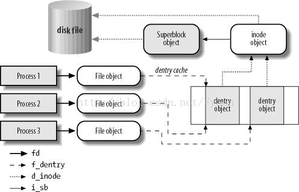

# Linux文件系统（二）-为仁由己

儒家倡导“修身齐家治国平天下”，认为“天下之本在国，国之本在家，家之本在身”。在儒家看来，通过修身养性而实现的人内在的身心和谐，是实现人际和谐、群己和谐，最后达至天人和谐的必要前提。只有“成己”才能“成人”，只有“成己”才能“成物”，出发点都是“成己”，就是自我内在的身心和谐。   Linux文件系统的魅力在于“成己” 亦“成人”。如果说整个Linux内核相当于一个“国”，那么，VFS 相当于一个“家”，且是一家之长，而各种具体的文件系统相当于“己”，或者说家庭中的一个个子女。在VFS统领的这个大家庭中，各个成员之所以能相互友好共存，在于其所具有共性和个性。   尽管我们熟知一些文件系统如Ext2/Ext3，NTFS，VFAT，JFS等，但是，要给文件系统下一个确切易懂的定义并不容易。文件系统似躲在**文件**背后一只无形的手，对文件进行种种的操作（打开，读，写等），从这个意义上说，文件系统是文件的**管理者（这是一种笼统的说法）**。然文件既不存放在真空中，也不存放在空气中，而通常存放在磁盘上（有时可能在内存，如/proc文件系统），因此说，文件系统实际上是对文件以及所存储空间的管理机制。 l**共性-抽象层**   虚拟文件系统VFS的第一个词是“虚拟”，这就意味着，这样的文件系统在磁盘（或其他存储介质上）并没有对应的存储信息。那么，这样一个虚无的文件系统到底怎样形成？尽管Linux支持多达几十种文件系统，但这些真实的文件系统并不是一下子都挂在系统中的，他们实际上是按需被挂载的。老子说：“有无相生”，这个“虚”的VFS的信息都来源于“实”的文件系统，所以VFS必须承载各种文件系统的共有属性。另外，这些实的文件系统只有安装到系统中，VFS才予以认可，也就是说，VFS只管理挂载到系统中的实际文件系统。   既然，VFS承担管家的角色，那么我们分析一下它到底要管哪些对象。Linux在文件系统的设计中，全然汲取了Unix的设计思想。Unix在文件系统的设计中抽象出四个概念：文件，目录项，索引节点和安装点(mount point)。 **文件系统中对象的演绎**

从本质上讲文件系统是特殊的数据分层存储结构，它包含文件、目录和相关的控制信息。文件系统的典型操作包含创建、删除和安装等等。在Unix中，文件系统被挂载在根文件系统的某个枝叶上，这就是**安装点**，安装点在全局的层次结构中具有独立的命名空间。

 如何给耳熟能详的**文件**给一个明确的定义？其实可以把**文件**看作是一个有序字节串，字节串中第一个字节是文件的头，最后一个字节是文件的尾。为了便于系统和用户识别，每一个文件都被分配了一个便于理解的名字。典型的文件操作有读、写、创建和删除等。

  文件系统通过**目录**来组织文件。文件目录好比一个文件夹，用来容纳相关文件。因为目录也可以包含子目录，所以目录可以层层嵌套，形成文件路径。路径中的每一部分被称作**目录项**，例如“/home/clj/myfile”是文件路径的一个例子，其中根目录是/，目录home,clj和文件myfile都是目录项。在Unix中，目录属于普通文件，所以对目录和文件可以实施同样的操作。

  文件系统如何对文件的属性（例如文件名，访问控制权限、大小、拥有者、创建时间等信息）进行描述？这就是大名鼎鼎的索引节点（index Inode）,为什么不叫文件控制块而叫索引节点，主要是因为有一个叫索引号的属性可以惟一的标识文件。

  以上说明了文件，目录项，索引节点，而更重要的是，如何描述各种文件系统的控制信息，这就是**超级块**，超级块是一种包含文件系统信息的数据结构。

通过以上的介绍，可以概括出VFS中四个主要的对象：

**超级块对象**，描述已安装文件系统。

**索引节点对象**，描述一个文件。

**目录项对象**，描述一个目录项，是路径的组成部分。

**文件对象**，描述由进程打开的文件。

注意，因为VFS将目录作为一个文件来处理，所以不存在目录对象。换句话说，目录项不同于目录，但目录却和文件相同.

**对象的和谐共存**

 图1显示的一个简单的实例，说明进程怎样与文件进行交互。三个不同进程打开同一个文件（用**inode object**表示），而每个打开的文件就是一个文件对象**file object**（体会文件和文件对象是截然不同的），其中两个进程使用同一个硬链接（说明这两个进程打开的文件在磁盘存放在相同的位置）。这里，每个进程都使用自己的文件对象，但只需要两个目录项对象**dentry object**，因为目录项对象描述的是路径，因此与硬链接对应。但是，殊途同归，这两个目录项对象实际上指向的是同一个索引节点对象，也就是说，索引节点对象+超级块对象（表示文件系统）就可以确切地标识普通的磁盘文件。（**这段文字左拐右绕，需静心体会，方可理解设计之根本）**

图1 进程与VFS对象之间的交互（摘自ULK）

 VFS除了能为所有文件系统的实现提供一个通用接口外，还必须关注系统性能。目录项高速缓存（dentry cache）就承担此角色，最近最常使用的目录项对象被放在这种缓存中，以加速把文件路径名转换成索引节点，也就是路径中的最后一项（文件）对应的索引节点。 l**为仁由己**  文件，目录项，索引节点，超级块，实际上是抽象出来的对象，但Linux文件系统在物理磁盘布局时把这些抽象的概念赋之实施。比如说在磁盘上，把文件(目录也属于文件)信息按照索引节点形式存储在单独的块中；把文件系统控制信息集中存储在磁盘的超级块中，等等（看看Ext2/Ext3磁盘信息的存储就了然）。各个具体文件系统尽力“成己”，实现了这些概念，VFS的设计目标就是要保证与这些文件系统协同工作。比如，FAT或NTFS这样的非Unix风格的文件系统，虽然也可以在Linux上工作，但是它们必须经过封装，提供一个符合这些概念的界面。比如，即使一个文件系统不支持索引节点，它也必须在内存中装配索引节点结构体，就像它本身包含索引节点一样。再比如，如果一个文件系统将目录看作是一种特殊对象，那么要想使用VFS，就必须将目录重新表示为文件形式。通常，这种转换需要在使用现场引入一些特殊处理，使得非Unix文件系统能够兼容Unix文件系统的使用规则并满足VFS的需求。通过这些处理，非Unix文件系统便可以和VFS一同工作了，也就是说，各个文件系统通过“修己”，而达到与VFS以及其他文件系统的**“****群己和谐”**[.](http://wwww.kerneltravel.net/index.php/buy-gestanin-by-phone)

##### 版权声明

本文仅代表作者观点，不代表本站立场。
本文系作者授权发表，未经许可，不得转载。